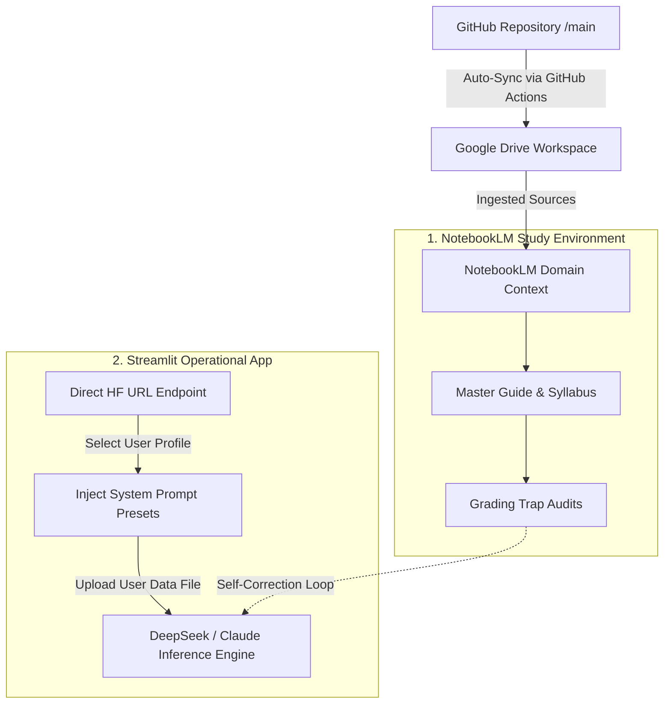

# The Weatherman AI Portal

A custom, zero-install Streamlit web application for operational team training and automated workspace simulation — no terminal, no CLI, no developer setup required.

Your entire team accesses the Weatherman AI Portal through a secure browser URL. Each member selects their name from a sidebar dropdown, which automatically loads their pre-configured API routing (DeepSeek R1 / OpenClaude) and master department system profiles. From there, they upload standard business files (`.csv`, `.xlsx`, `.pdf`) and interact using natural-language prompts to complete realistic operational exercises, generate reports, and produce polished deliverables.

Everything lives in one place: the syllabus, the data files, and the workspace presets — all served through a clean web interface.

---

## 🔄 Dual-Notebook Architecture

The repository operates on a **dual-hub ecosystem**: **NotebookLM** operates as the static training classroom, and the **Streamlit Web App** acts as the live operational simulator.



---

## 📊 Ecosystem Analytics

* **Total Active Tracks:** 5 Departments (Management, Logistics, Financials, Marketing, Creative Design)
* **Total Workspace Presets:** 21 Pre-optimized task prompts
* **Core Engine:** Dual-Engine Selection (DeepSeek Data/Logic vs. OpenClaude Creative/Copy)
* **Automated Sync Gate:** GitHub Actions operational on repository push events to keep training data mirrored directly to live training engines.

---

## 👥 User Stories & Track Focus

### 👔 Rick — Executive, Entrepreneurship & Management
* **Focus Area:** Executive dashboarding, corporate KPI modeling, strategic planning, PRD & presentation automation.
* **User Story:** *"As an executive, I want to upload department budgets and milestone matrices so that I can automatically spot fulfillment anomalies, isolate risk quarters, and output comprehensive Product Requirement Documents (PRDs) without manual compilation."*

### 📦 Sunny — Purchasing & Logistics
* **Focus Area:** Vendor data validation, lead time analysis, customs tariff auditing, warehouse balancing.
* **User Story:** *"As a supply chain specialist, I want to drop raw vendor invoices and transit CSVs into the portal so that the AI can instantly execute a Lead Time Anomaly Audit and flag custom tariff mismatches."*

### 📈 Mollie — Sales & Financials
* **Focus Area:** Order-to-profit analysis, financial reconciliation, root-cause investigation, automated alerting.
* **User Story:** *"As a financial analyst, I want to connect raw Shopify export feeds and marketing spend sheets to run Monte Carlo simulations on margin variance and detect ledger anomalies."*

### 📣 Christine — Marketing
* **Focus Area:** Brand compliance, email automation, listing verification, campaign analytics.
* **User Story:** *"As a marketing manager, I want to pass email campaign mockups and product listings against our Master Brand Book parameters to guarantee 100% messaging compliance and copy optimization."*

### 🎨 Design (Paula & Gaby) — Creative Design
* **Focus Area:** SVG auditing, design token validation, asset inventory management, component compilation and asset optimization.
* **User Story:** *"As a creative designer, I want to batch upload SVG assets and design token JSON files to automatically catch structural validation errors and compile unified component specs."*

---

## 🌐 Institutional Memory Infrastructure

This portal is backed by a dual-notebook system in NotebookLM. Each track has a dedicated Domain Notebook encoding its processes, data schemas, and edge cases, plus a shared Master Guide.

| Role / Track | Source Scope | Ingestion Endpoint URL |
|---|---|---|
| **🏢 Master Guide** | Global Cross-Functional | [Access Master Notebook](https://notebooklm.google.com/notebook/4bdb17a3-6657-4d63-adbe-8f63c22521c2?authuser=1) |
| **👔 Rick** | Executive & Management | [Access Rick's Notebook](https://notebooklm.google.com/notebook/8644375a-5c5f-442d-b35b-fb849e3f93b2?authuser=1) |
| **📦 Sunny** | Purchasing & Logistics | [Access Sunny's Notebook](https://notebooklm.google.com/notebook/c3dc698d-38e7-4d64-8451-0bbca3fa9d97?authuser=1) |
| **📈 Mollie** | Sales & Financials | [Access Mollie's Notebook](https://notebooklm.google.com/notebook/2ab95bfd-ceeb-436d-b41f-85a89e3ca749?authuser=1) |
| **📣 Christine** | Marketing Hub | [Access Christine's Notebook](https://notebooklm.google.com/notebook/0a616bb3-6ea7-40c8-b53c-984fa4d977bc?authuser=1) |
| **🎨 Design** | Asset & UI Optimization | [Access Design Notebook](https://notebooklm.google.com/notebook/9f67d0db-49c8-4bc3-b2e5-f08a3528028f?authuser=1) |

---

## 📂 Repository Tree Structure

```
training/
├── _sync_config/              # GDrive automated workflow mappings
├── rick/                      # Executive, Entrepreneurship & Management
│   ├── syllabus.md            # Course outline and lesson plans
│   ├── data/                  # Executive dashboards, inventory logs, fulfillment reports
│   ├── exercises/             # 5 progressive portal walkthroughs
│   └── presets/               # Workspace presets (4)
├── sunny/                     # Purchasing & Logistics
│   ├── syllabus.md            # Course outline and lesson plans
│   ├── data/                  # Vendor CSVs (lead times, invoices, prices)
│   ├── exercises/             # 5 progressive portal walkthroughs
│   └── presets/               # Workspace presets (5)
├── mollie/                    # Sales & Financials
│   ├── syllabus.md
│   ├── data/                  # Shopify exports, ad spend, webhook samples
│   ├── exercises/             # 5 progressive portal walkthroughs
│   └── presets/               # Workspace presets (4)
├── christine/                 # Marketing
│   ├── syllabus.md
│   ├── data/                  # Copy decks, email campaigns, keyword targets
│   ├── exercises/             # 5 progressive portal walkthroughs
│   └── presets/               # Workspace presets (4)
└── design/                    # Design
    ├── syllabus.md
    ├── data/mock-assets/      # SVGs, design tokens JSON
    ├── exercises/             # 5 progressive portal walkthroughs
    └── presets/               # Workspace presets (4)
```

---

## ⚙️ Core Workspace Presets

Each system preset automatically injects distinct operational parameters into the active AI instance upon activation:

* **Rick:** `fulfillment-anomaly-detector`, `write-a-prd`, `ppt-generation`, `architecture-diagram`
* **Sunny:** `lead-time-anomaly`, `customs-tariff-audit`, `warehouse-balancing`, `xlsx-processing`, `data-table-validator`
* **Mollie:** `csv-analytics`, `monte-carlo-analyze-root-cause`, `reconciliation-engine`, `anomaly-alert-webhook`
* **Christine:** `brand-guardrails`, `email-automation`, `listing-verification`, `campaign-analytics`
* **Design:** `svg-auditor`, `design-token-validator`, `component-spec-compiler`, `asset-pack-optimizer`

---
> "Unified cross-functional training interface and execution workspace. Leverages pre-configured system profile presets to interpret, audit, and analyze active department data sheets without local development dependencies."
